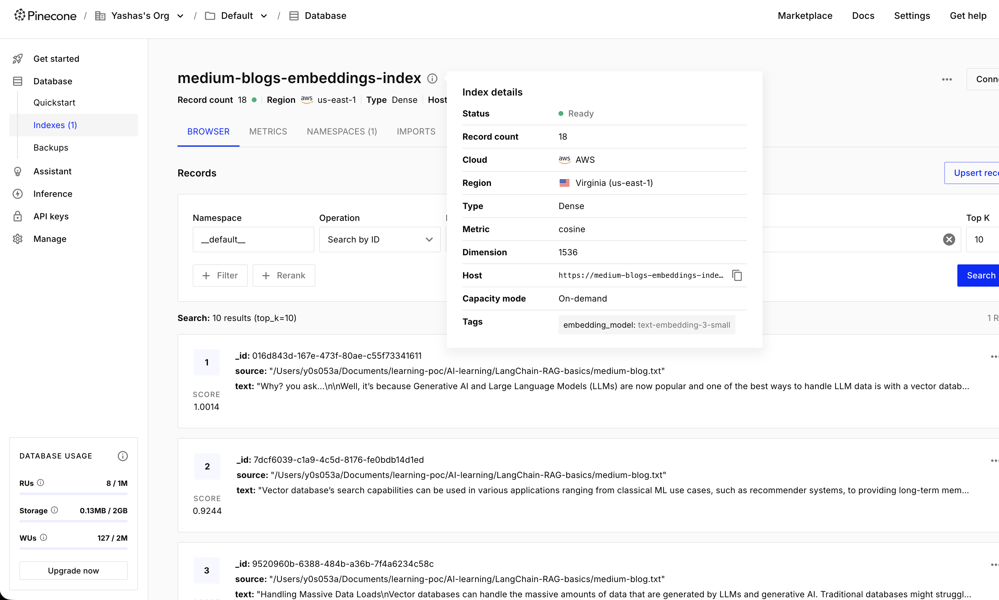
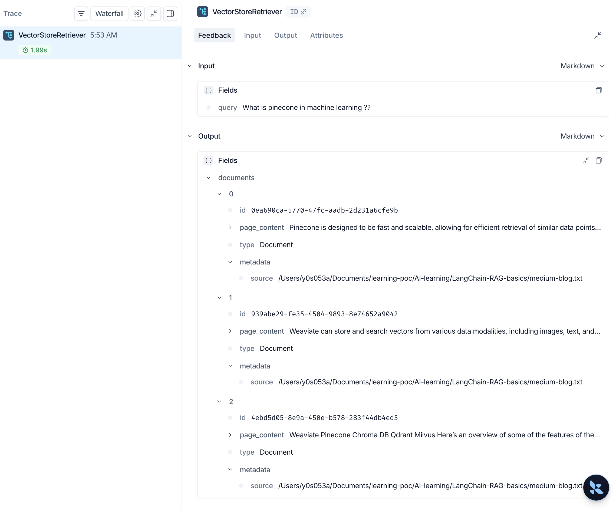
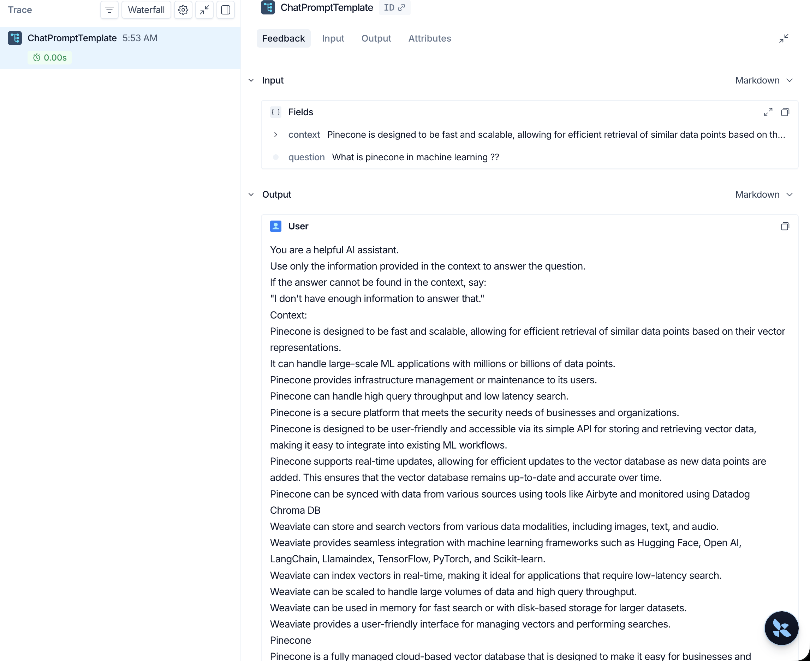
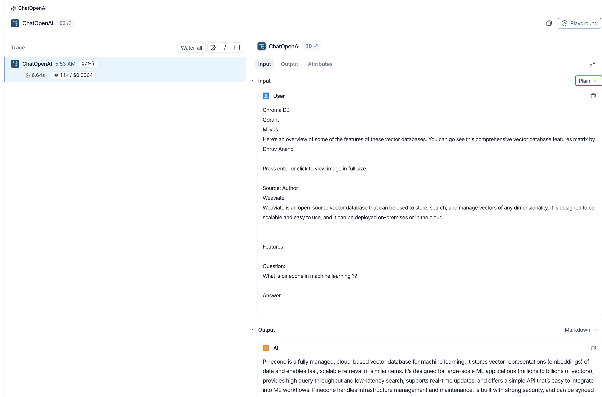

## Implementing Basic RAG Pipeline  to read through [medium-blog.txt] static using two methods

Vectore Store used - Pinecone

Ingestion - [ingestion.py]

### Without LangChain Chains/Expression Language
retrieveWithoutLangChainExpressionLanguage()

problems:
Tracing is hard as components are not connected
retrieval from vector store

Final LLM invocation with augmented Query after retrieval 

langSmith link - https://smith.langchain.com/public/9efde622-96ab-475a-b994-d52527df5a18/r/019f2035-4df1-70d2-845d-630d72fc05e7

https://smith.langchain.com/public/e66fec82-011b-4f90-8a5f-e0dc8c8b17a9/r/019f2035-55b9-7342-afaa-cdca69c35d18

### using native  LangChain Chains
retrieveWithLangChainExpressionLanguage()